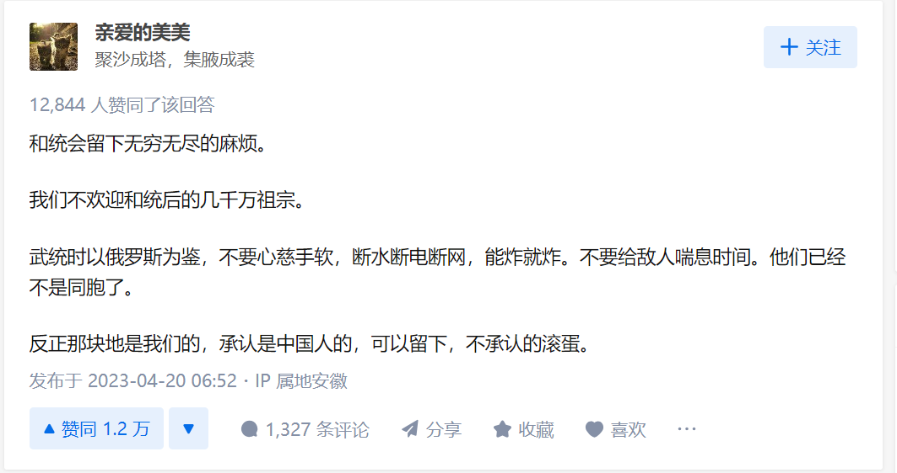
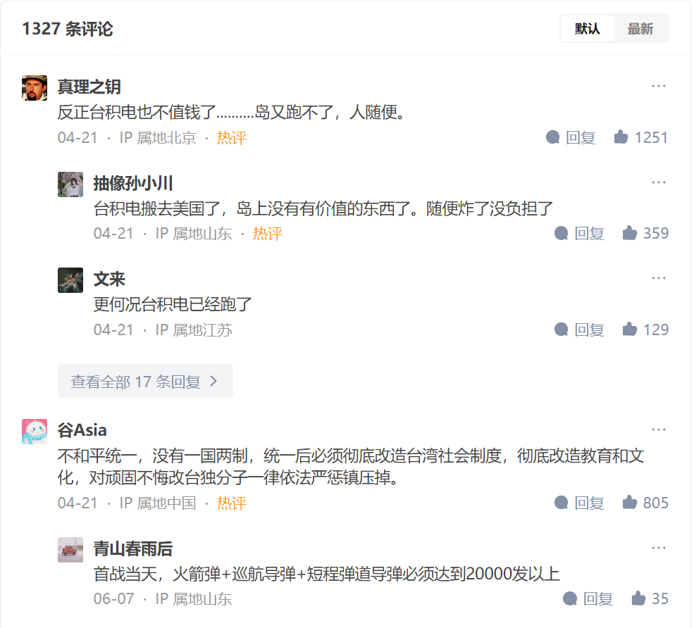

问题：大陆人对台湾人是什么想法？

[作者亲爱的美美的答案：](https://www.zhihu.com/question/65530555/answer/2991918480)
```
和统会留下无穷无尽的麻烦。 我们不欢迎和统后的几千万祖宗。 武统时以俄罗斯为鉴，不要心慈手软，断水断电断网，能炸就炸。不要给敌人喘息时间。他们已经不是同胞了。 反正那块地是我们的，承认是中国人的，可以留下，不承认的滚蛋。
```


